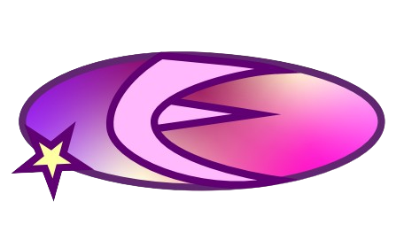

<a name="readme-top">

<br/>

<br />
<div align="center">
  <a href="https://github.com/suhnity/">
  <!-- TODO: If you want to add logo or banner you can add it here -->
    
  </a>
<!-- TODO: Change Title to the name of the title of your Project -->
  <h3 align="center">Finals Activity</h3>
</div>
<!-- TODO: Make a short description -->
<div align="center">
This is my personal website! Come and take a look at my initial projects and coursework demonstrating my understanding of IT and Business Analytics principles. It contains interactive navigational buttons that are both functional and visually engaging. My knowledge in HTML, CSS, and layout techniques helped me to create a user-friendly website.
</div>

<br />


</div>

<br />


---

<br />
<br />

<details>
  <summary>Table of Contents</summary>
  <ol>
    <li>
      <a href="#overview">Overview</a>
      <ol>
        <li>
          <a href="#key-components">Key Components</a>
        </li>
        <li>
          <a href="#technology">Technology</a>
        </li>
      </ol>
    </li>
    <li>
      <a href="#rule,-practices-and-principles">Rules, Practices and Principles</a>
    </li>
    <li>
      <a href="#resources">Resources</a>
    </li>
  </ol>
</details>

---

## Overview
This project showcases my journey and projects in Information Technology, highlighting the skills and experiences I've gained throughout my coursework. This aims to document my learning journey, share knowledge with others, and demonstrate proficiency in web development using HTML, CSS, JavaScript, and other languages.

### Key Components
- MultiPage Website
- Engaging and Interactive Navigation Buttons
- Visually Appealing

### Technology
<!-- TODO: List of Technology Used -->


## Rules, Practices and Principles
1. Always use `WD-` in the front of the Title of the Project for the Subject followed by your custom naming.
2. Do not rename any .html files; always use `index.html` as the filename.
3. Place Files in their respective folders.
4. All file naming are in camel case.
   - Camel case is naming format where there is no white space in separation of each words, the first word is in all lower case while the succeding words first letter are in upper followed by lower cased letters.
   - ex.: buttonAnimatedStyle.css
5. Use only `External CSS`.
6. Renaming of Pages folder names are a must, and relates to what it is doing or data it holding.
7. File Structure to follow below.

```
WD-ProjectName
└─ assets
|   └─ css
|   |   └─ style.css
|   └─ img
|   |   └─ fileWith.jpeg/.jpg/.webp/.png
|   └─ js
|       └─ script.js
└─ pages
|  └─ pageName
|     └─ assets
|     |  └─ css
|     |  |  └─ style.css
|     |  └─ img
|     |  |  └─ fileWith.jpeg/.jpg/.webp/.png
|     |  └─ js
|     |     └─ script.js
|     └─ index.html
└─ index.html
└─ readme.md
```

## Resources

<!-- TODO: Add References -->
| Title | Purpose | Link |
|-|-|-|
| Own-made read me icon | For readme icon purposes | Made with Adobe Illustrator |
| Animations | Inspiration of animation codes | (https://devdevout.com/) |

